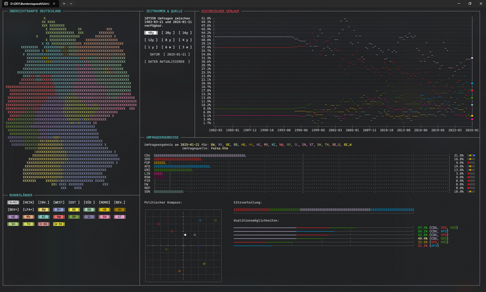

# Bundestagswahl

A terminal-based polling client for the German federal elections (Bundestagswahlen).

The polling data is fetched from https://www.wahlrecht.de/umfragen/.

> [!NOTE]
> The following screenshot is from an **older** version of the program (See commit [`7555190990ea797923a4082cc46cb46f23c72de0`](https://github.com/Unknown6656/Bundestagswahl/commit/7555190990ea797923a4082cc46cb46f23c72de0) or earlier).
> 

