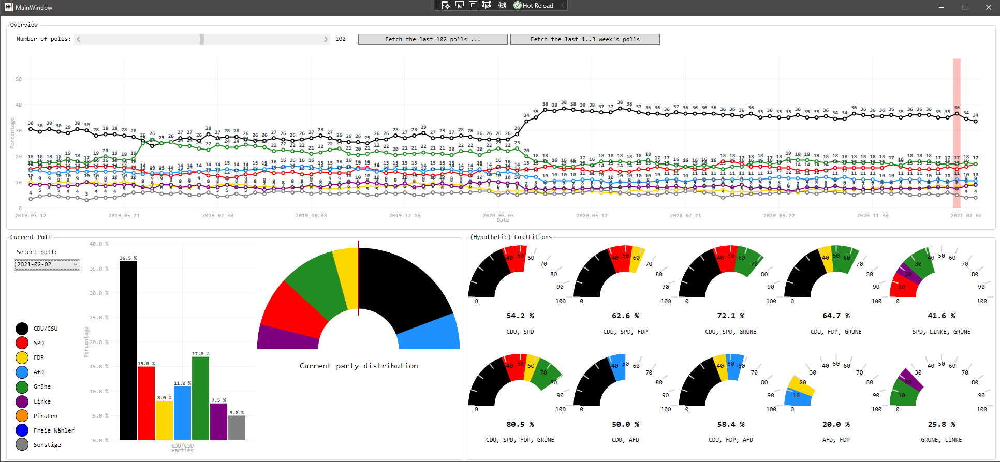

# Bundestagswahl

A terminal-based polling client for the German federal elections (Bundestagswahlen).

>[!NOTE] The following screenshot is from an older version of the program (See commit 7555190990ea797923a4082cc46cb46f23c72de0 or earlier).

The polling data is fetched from https://www.wahlrecht.de/umfragen/.
